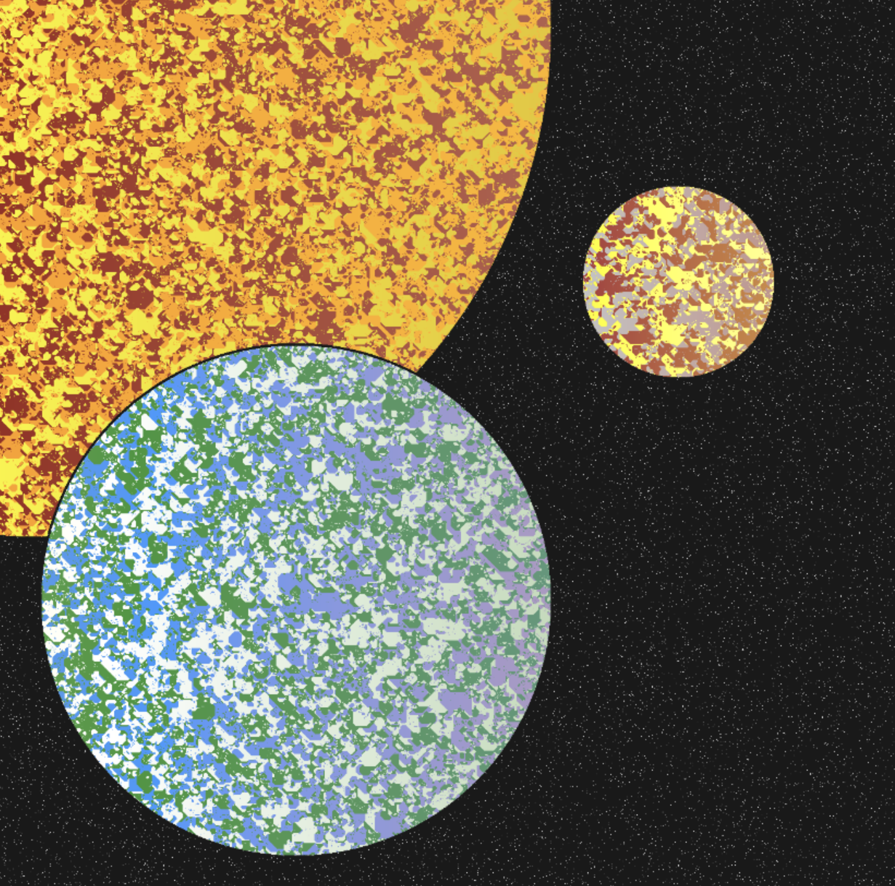

```{r setup, include=FALSE}
knitr::opts_chunk$set(echo = FALSE)
```
```{r}
spotify = read.csv("Popular_Spotify_Songs.csv", header =  TRUE)
```

```{r}
library(ggplot2)
```
# Generative Artwork

### Home



### Fire Spiral


# ggplot Extension Project

```{r, echo=FALSE, results='hide'}
 library(ggplot2)
 library(ggcorrplot)
download.file("https://vincentarelbundock.github.io/Rdatasets/csv/AER/Electricity1955.csv", "Electricity1955.csv")
```
```{r}
electricity = read.csv("Electricity1955.csv")[1:145,]
attach(electricity)
corr = round(cor(electricity), 1)
```
### basic ggcorrplot
```{r}
ggcorrplot(corr)
```
Data set: Electricity1955


Variables:cost,output,labor,labor share, capital, capital share, fuel and fuel share

“ggcorrplot” is used to visualize correlation matrices, which are tables that show the correlation between multiple quantitative variables. The purpose of this package is to make it easier to understand the relationship between variables and identify potential patterns in the data by allowing users to customize their tables. Red boxes indicate a stronger positive correlation, whereas blue boxes imply a more negative correlation.


### Hierarchical Clustering

```{r}
 ggcorrplot(corr, hc.order = TRUE, outline.color = "black")
```
 We can reorder the correlation matrix using hierarchical clustering to group similar variables together and add an outline color to the heatmap for better visualization


###  Correlation Coefficients and Significance Levels

```{r}
ggcorrplot(corr,
 hc.order = TRUE,
 type = "lower",
 lab = TRUE)
 # adds correlation coefficients
```

We can show correlation coefficients in each cell by using the “lab = TRUE” argument.

```{r}
 pvals.mat <- cor_pmat(electricity) # creates a matrix of correlation p-values
 ggcorrplot(corr,
 hc.order = TRUE,
 type = "lower",
 p.mat = pvals.mat)
 # shows significant coefficients
```
Instead of listing all of the correlation coefficients, what if we want to focus on correlations that are significant? We can create a matrix of correlation p-values and store it in a variable called “pvals.mat”, then add the argument “p.mat = pvals.mat” when creating the correlation matrix. If a correlation coefficient has a p-value higher than 0.05, then the correlation is not statistically significant,which is indicated by an “X” in the corresponding cell.

# Confidence Interval Dashboard
<iframe src="https://abby-flynt.shinyapps.io/ConfidenceLevels_Dashboard_Team5/"
class="I-screen-inset shaded" height="1000px"></iframe>

The main goal behind my dashboard is to demonstrate the concept of confidence 
intervals clearly. Since confidence intervals are regarded as one of the most challenging concepts 
to grasp in introductory statistics, I sought to use dashboard to tackle this issue. First, it simulates a normally distributed population—adjustable via a sidebar slider—and repeatedly draws samples of a chosen size. Each sample’s mean and its confidence interval are plotted alongside the true population mean, illustrating that at, say, 95% confidence roughly 19 out of 20 intervals will contain the true mean. Second, it tackles categorical data by simulating two groups’ “yes”/“no” response proportions and performing a permutation test: random reassignments create a null distribution of difference‑in‑proportions, with the observed difference shown in red against a blue confidence band. If the red line lies outside that band, group membership significantly influences outcomes. By pairing continuous‑variable CIs with a categorical permutation CI approach, the dashboard demystifies confidence intervals across both data types in a single, interactive tool.

# Bucknell Data Viz Challenge
```{r}
library(Lock5Data)
data(CollegeScores)
```

```{r}
missing.vals = function(dataframe){

NAs = colSums(is.na(dataframe))
return(NAs)
}
CollegeData = CollegeScores[complete.cases(CollegeScores), ]
rm(CollegeScores)
CollegeData = CollegeData[CollegeData$Name != "University of the Virgin Islands", ]
CollegeData$Locale = factor(CollegeData$Locale)
CollegeData$Region = factor(CollegeData$Region)
CollegeData$Main = factor(CollegeData$Main, levels = c(0, 1),
labels = c("Branch Campus", "Main Campus"))

CollegeData$MainDegree = factor(CollegeData$MainDegree, levels = c(0, 1, 2, 3, 4),

labels = c("Not Classified", "Certificate",

"Associate", "Bachelors", "Only Graduate"))

CollegeData$HighDegree = factor(CollegeData$HighDegree, levels = c(0, 1, 2, 3, 4),

labels = c("No Degrees", "Certificate",
"Associate", "Bachelors", "Graduate"))
CollegeData$MainDegree = factor(CollegeData$MainDegree)
CollegeData$HighDegree = factor(CollegeData$HighDegree)
names(CollegeData)[names(CollegeData) == "Control"] = "Type"
attach(CollegeData)
```
```{r}
 ggplot(CollegeData, aes(x = CollegeData$AdmitRate * 100, y = CompRate)) +
 geom_point(alpha = 0.6, color = "white") +
 geom_point(data = CollegeData[CollegeData$Name == "Bucknell University", ],
 aes(x = AdmitRate * 100, y = CompRate),
 color = "orange", size = 3, shape = 15) +
 geom_text(
 data = CollegeData[CollegeData$Name == "Bucknell University", ],
 aes(x = AdmitRate * 100, y = CompRate),
 label = "Bucknell",vjust = 2 ,
 color = "blue",
 fontface = "bold"
 )+
 xlab("Admission Rate")+
 ylab("Completion Rate")+
 ggtitle("Bucknell University: Completion vs. Admission Rate") +
 theme_dark()
```
Data set: CollegeData


Variables: Admission Rate and Competition Rate


This graphic was created to show an interesting visualization and narrative that tells a story about Bucknell in comparison to other Universities in CollegeData dataset. Using this data I found that Bucknell University is approximately the 5.7th percentile when it comes to admission rate, meaning that the school is much tougher to get into then many other universities within the dataset. Additionally it falls in the 96th percentile for completion rate meaning it places near the top universities in the country in terms of student success and graduation outcomes. With these two percentiles in mind you can come to the conclusion that Bucknell is tougher to get into then many other universities, but also provides an environment where students likely to succeed and graduate. This is shown in the visualization where bucknell is shown to be nearly at the top of Completion Rate and on the lower side of the Admission Rate. With having a tough admission rate as well as a impressively high completition rate Bucknell can be seen as a strong example of both academic excellence as well as institutional success.

### Getting Fancy with ggplot customizations 
```{r}
 library(ggplot2)
 library(Lock5Data)
 data("BikeCommute")
```

```{r}
ggplot(BikeCommute, aes(x = TopSpeed, y = AvgSpeed)) +
  geom_point() +
  geom_smooth(method = "lm") +
  ggtitle("AvgSpeed vs TopSpeed") +
  theme(
    plot.background = element_rect(fill = "red", colour = NA),
    panel.background = element_rect(fill = "pink", colour = NA),
    axis.text = element_text(colour = "white"),
    axis.title = element_text(colour = "white"),
    plot.title = element_text(face = "bold", colour = "white")
  )
theme_set(theme_grey())
```
Data: BikeCommute


Variables: Top Speed and Average Speed.

This plot was created to demonstrate how to get creative and customize visualizations within ggplot. The data includes 56 observations with 9 total variables and comes from the Lock5Data package. This is graph uses code to make and customize a new theme rather than using a pre-installed one. This visualization was created around valentines day so I wanted it give a vibe based on the holiday. The main take away from this visualization is that it shows a moderately strong postive linear correlation with a correlation value of 0.7118367. Though not crucial on the data department, this graphs was one of my favorites to make as it let me be creative and opened the door to customizing visualization in a way that I like rather then using a template all the time.
